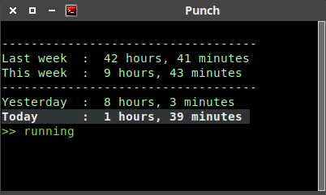

# terminal-punch



`terminal-punch` is a simple command-line time tracker.


Installation
----------------------------------------

    cabal new-install terminal-punch


Stability
----------------------------------------

Despite its early stage, `terminal-punch` seems to work very reliably. It has a [property-based test suite](https://github.com/emilaxelsson/terminal-punch/blob/master/tests/Tests.hs) that covers most aspects of its time measurement.


Basic operation
----------------------------------------

Start by running `punch` in a terminal.

(Since the name of the executable is `punch`, I will use that name for the program in the remainder of the text.)

The program listens to the following keys:

  * **space** to start or stop an interval.
  * **q** or **esc** to quit.
  * Any other key to update the summary.
      - This is useful if time has passed since `punch` was started or if the log file has been updated (see below).

Note that since the start/stop events are persisted in a log file (see below), `punch` doesn't need to be running in the background. It can just be opened temporarily for starting/stopping or viewing the summary. Personally, I use a keyboard shortcut to fire up a terminal with `punch` running in it.

By default, the summary will show the total time for the following periods:

  * Last week
  * This week
  * Yesterday
  * Today

Additional periods can be added by inserting period markers in the log file. We will explain how this is done later.


The log file
----------------------------------------

`punch` stores its time log in `$HOME/.punch`. Here is an example of what the file can look like:

```
Start 2019-01-17 12:29:13.80010349
Stop 2019-01-17 18:51:45.009426249
Start 2019-01-17 18:51:47.342016491
Stop 2019-01-17 19:10:45.566312123

Period "New job"
-- Started my new job
Start 2019-01-18 08:31:00
Stop 2019-01-18 13:40:00
Start 2019-01-18 16:16:00
Stop 2019-01-18 18:39:26.115783139
```

Each line must be one of:

  * A start event, using the keyword `Start`
  * A stop event, using the keyword `Stop`
  * A period marker, using the keyword `Period`
  * A comment, starting with `--`
  * An empty line

The syntax for time stamps should be self-explanatory from the above example. Note that the eight-digit number denoting fractions of a second is optional.

`punch` requires the `Start`/`Stop` events to appear in alternating order. That is, there must not be a sequence consisting of two `Start` events without a `Stop` in between, and vice versa. Moreover, the time stamps must appear in increasing order. If the log gets corrupted, it can only be fixed by manual editing.


Working with the log file
----------------------------------------

`Start`/`Stop` lines are automatically appended to the log when an interval is started or stopped. This is the only thing `punch` ever does to the log; it will never change the existing content of the file. This means that it is completely safe to edit the log file between start/stop events.

Users are expected to manually edit the log in the following situations:

  * To fix/add/remove incorrect or missing events (e.g. when the user forgot to start or stop an interval in time).
  * To insert period markers or comments.

Period markers are used to measure time over longer periods. For example, inserting the line

    Period "New job"

somewhere in the log tells `punch` to keep track of the total time from that point on. The result will be seen as an extra line in the summary:

```
-----------------------------------
New job    :  4 hours, 8 minutes
Last week  :  42 hours, 41 minutes
This week  :  9 hours, 43 minutes
-----------------------------------
Yesterday  :  8 hours, 3 minutes
Today      :  1 hours, 39 minutes
```

Any number of period markers can be inserted into the log.


Limitations and future work
----------------------------------------

`punch` doesn't currently have a way to distinguish between different kinds of work.

One idea for fixing this problem would be to support different "projects". Each project could have its own log file in the `.punch/` directory. Some ideas regarding this approach:

  * Need a better UI for switching between projects. Probably best to use [brick](https://hackage.haskell.org/package/brick) for this.
  * Switching project should automatically stop any running interval in the current project.
  * The current project should be remembered between runs.
  * Summary view could show totals both for the current project and for all projects combined.
